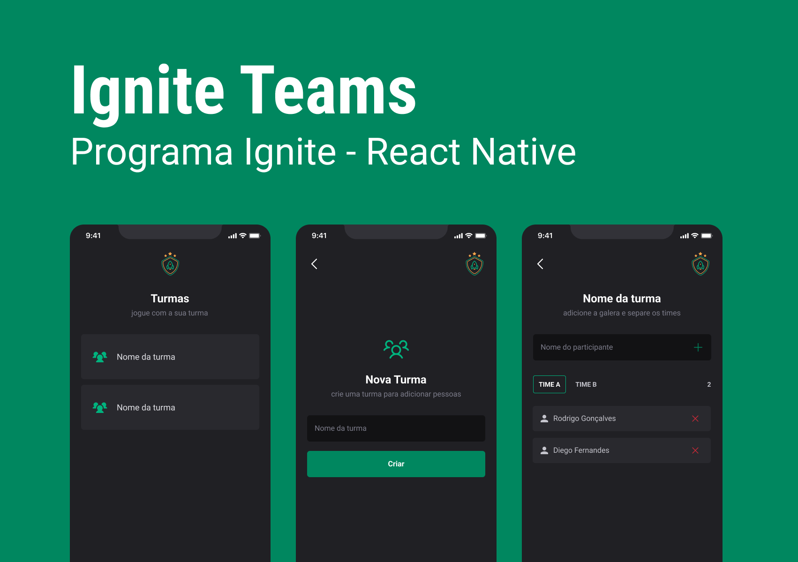
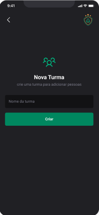
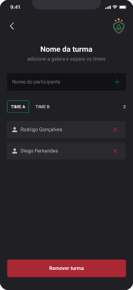

<!-- CABEÇALHO -->

    <h1>
        Ignite Teams
    </h1>
    

        <a href="#%EF%B8%8F-sobre-o-projeto">Sobre o Projeto</a> •
        <a href="#-funcionalidades">Funcionalidades</a> •
        <a href="#-layout">Layout</a> •
        <a href="#%EF%B8%8F-tecnologias">Tecnologias</a> •
        <a href="#-autor">Autor</a>
    

<!-- SOBRE O PROJETO -->

## 🖥️ Sobre o Projeto

        

> Projeto desenvolvido durante o módulo Criando Interfaces e Navegação da formação de React Native da **[Rocketseat](https://www.rocketseat.com.br/)**.

Esse projeto consiste em uma aplicação mobile para gerenciar a organização de pessoas que jogam algum jogo em turmas.

Projeto realizado com o objetivo de aprender conceitos e ferramentas importantes como CSS-in-JS com Styled Components, navegação, armazenamento local, e muito mais.

<!-- FUNCIONALIDADES -->

## 💡 Funcionalidades

- [x] Listar as turmas
- [x] Adicionar uma turma
- [x] Remover uma turma
- [x] Listar os jogadores de uma turma
- [x] Adicionar um jogador em uma turma
- [x] Remove um jogador de uma turma

<!-- LAYOUT -->

## 🎨 Layout

> A aplicação tem como base o seguinte layout no [Figma](https://www.figma.com/community/file/1151864427495057381/ignite-teams)

  
  

<!-- TECNOLOGIAS -->

## 🛠️ Tecnologias

Para o desenvolvimento desse projeto, as seguintes ferramentas foram utilizadas:

- **[React Native](https://reactnative.dev/)**
- **[Expo](https://expo.dev/)**
- **[TypeScript](https://www.typescriptlang.org/)**
- **[Styled Components](https://styled-components.com/)**
- **[React Navigation](https://reactnavigation.org/)**
- **[Async Storage](https://react-native-async-storage.github.io/async-storage/)**

<!-- AUTOR -->

## 👨‍💻 Autor

Marcos Kenji Kuribayashi

 

---

Desenvolvido por Marcos Kenji Kuribayashi 😉
